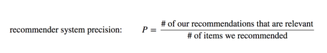

# Laporan Proyek Machine Learning - Reza Faisal

## Domain Proyek (Keuangan)

Deposito berjangka merupakan sumber pendapatan utama bagi bank. Deposito berjangka adalah investasi tunai yang disimpan di lembaga keuangan. Uang Anda diinvestasikan pada tingkat bunga yang disepakati dalam jangka waktu atau jangka waktu tertentu. Bank memiliki berbagai rencana penjangkauan untuk menjual deposito berjangka kepada nasabahnya seperti pemasaran email, iklan, pemasaran telepon, dan pemasaran digital.

Kampanye pemasaran melalui telepon masih tetap menjadi salah satu cara paling efektif untuk menjangkau masyarakat. Namun, kampanye ini memerlukan investasi besar karena pusat panggilan (call center) besar dipekerjakan untuk benar-benar melaksanakan kampanye ini. Oleh karena itu, penting untuk mengidentifikasi nasabah yang paling mungkin melakukan konversi terlebih dahulu sehingga mereka dapat ditargetkan secara spesifik melalui panggilan telepon.

## Business Understanding

Berdasarkan latar belakang yang sudah dipaparkan sebelumnya, berikut rincian masalah yang dapat diselesaikan dalam proyek ini :

- Bagaimana cara mengetahui nasabah yang berpeluang untuk menerima penawaran penjualan deposito?
- Apa faktor paling berpengaruh yang menentukan nasabah menerima tawaran tersebut atau tidak?

### Goals

- Untuk mengetahui nasabah yang berpeluang untuk menerima penawaran penjualan deposito.
- Untuk mengetahui faktor paling berpengaruh yang menentukan nasabah menerima tawaran tersebut atau tidak.

### Solution statements
  - Melakukan proses *Exploratory Data Analysis* untuk melihat fitur yang berpengaruh terhadap nasabah untuk menerima tawaran atau tidak.
  - Menggunakan model *Machine Learning* untuk memprediksi nasabah menerima tawaran tersebut atau tidak. Berikut model yang akan digunakan:
    - ***Support Vector Machine Classifier***
    - ***Neural Network Classifier***

## Data Understanding

Dataset ini berasal dari platform open source *<https://kaggle.com>*, dataset tersebut terkait dengan kampanye pemasaran langsung (panggilan telepon) dari lembaga perbankan Portugis. Data ini terdiri dari 2 file train.csv dan test.csv yang dimana:

- train.csv memiliki 45.211 baris dan 18 kolom
- test.csv memiliki 4521 baris dan 18 kolom

Tujuan dari proyek klasifikasi ini adalah untuk memprediksi apakah nasabah akan berlangganan deposito berjangka.

### Informasi data

Link dataset : <https://www.kaggle.com/datasets/prakharrathi25/banking-dataset-marketing-targets>
| **Attribute** | **Keterangan** | **Tipe Data** |
|---|---|---|
| age | usia nasabah | integer |
| job | pekerjaan nasabah | polynominal |
| marital | status pernikahan | polynominal |
| education | pendidikan terakhir nasabah | polynominal |
| default | nasabah memiliki kartu kredit secara default | binominal |
| balance | saldo tahunan rata-rata, dalam euro | float |
| housing | pinjaman perumahan | binominal |
| loan | pinjaman pribadi | binominal |
| contact | jenis komunikasi | polynominal |
| day | hari kontak terakhir pada bulan tersebut | integer |
| month | last contact month of year | polynominal |
| duration | durasi kontak terakhir, dalam hitungan detik | integer |
| campaign | jumlah kontak yang dilakukan selama kampanye ini dan untuk klien ini | integer |
| pdays | jumlah hari yang berlalu setelah klien terakhir dihubungi dari kampanye sebelumnya (angka, -1 berarti klien belum pernah dihubungi sebelumnya) | integer |
| previous | jumlah kontak yang dilakukan sebelum kampanye ini dan untuk klien ini | integer |
| poutcome | hasil kampanye pemasaran sebelumnya | polynominal |
| y | apakah klien sudah berlangganan deposito berjangka? | binominal |

Tabel 1. Atribut dan Penjelasan Deskripsi Setiap Fitur.  

### Berikut rangkuman `statistik deskriptif` dari fitur dalam dataset

| **Pregnancies** | **age** | **balance** | **day** | **duration** | **campaign** | **pdays** | **previous** |
|---|---|---|---|---|---|---|---|
| count | 45.211.000.000 | 45.211.000.000 | 45.211.000.000 | 45.211.000.000 | 45.211.000.000 | 45.211.000.000 | 45.211.000.000 |
| mean | 40.936.210 | 1.362.272.058 | 15.806.419 | 258.163.080 | 2.763.841 | 40.197.828 | 580.323 |
| std | 10.618.762 | 3.044.765.829 | 8.322.476 | 257.527.812 | 3.098.021 | 100.128.746 | 2.303.441 |
| min | 18.000.000 | -8.019.000.000 | 1.000.000 | 0 | 1.000.000 | -1.000.000 | 0 |
| 25% | 33.000.000 | 72.000.000 | 8.000.000 | 103.000.000 | 1.000.000 | -1.000.000 | 0 |
| 50% | 39.000.000 | 448.000.000 | 16.000.000 | 180.000.000 | 2.000.000 | -1.000.000 | 0 |
| 75% | 48.000.000 | 1.428.000.000 | 21.000.000 | 319.000.000 | 3.000.000 | -1.000.000 | 0 |
| max | 95.000.000 | 102.127.000.000 | 31.000.000 | 4.918.000.000 | 63.000.000 | 871.000.000 | 275.000.000 |

Tabel 2. Statistik Deskriptif Dataset  
 

### Berikut Visualisasi data Categorical Features pada Histogram

Gambar 1. Distribusi Fitur Job

Pada fitur job, terdapat nilai yang paling sering muncul yaitu *blue-collar*, *management* dan *technician*. Serta yang paling sedikit yaitu *student* dan *unknown*
  

Gambar 2. Distribusi Fitur Education

Pada Gambar 2 yang paliing banyak yaitu nilai *secondary* serta yang paling sedikit yaitu *unknown*
  

Gambar 3. Distribusi Fitur marital

Pada fitur ini, yang paling banyak berstatus *married*.
  

Gambar 4. Distribusi Fitur Default

Hampir semua nasabah memiliki credit card secara default sebanyak 35000 data.
  

Gambar 5. Distribusi Fitur Housing

Pada fitur ini hampir memiliki nilai yang sama, tapi nasabah kebanyakan masih memiliki *housing loan* dibanding yang tidak.
  

Gambar 6. Distribusi Fitur Loan

Hampir kebanyakan nasabah memiliki *loan* atau pinjaman.
  

Gambar 7. Distribusi Fitur Contact

Kebanyakan nasabah dihubungi / dikontak menggunakan *cellular* serta yang paling sedikit menggunakan *telephone*
  

Gambar 8. Distribusi Fitur Month

Fitur ini adalah bulan dimana nasabah dihubungi, dan yang paling sering ada di bulan *may* dan yang paling sedikit ada di bulan *december*.
  

Gambar 9. Distribusi Fitur Poutcome

Fitur ini meruapakan hasil kampanye pemasaran sebelumnya, kebanyakan memiliki nilai *unknown* dan yang paling sedikit yaitu *success*.
  

Gambar 10. Distribusi Fitur Y

Dari data yang disediakan, kebanyakan data memiliki nilai "no"
  

Berdasarkan visualisai data kategorik, dapat dilihat bahwa distribusi nilai dari setiap fitur tidak terlalu merata.
### Berikut Visualisasi data Numerical Features pada histogram

Gambar 11. Distribusi Fitur Numerik  

Pada bagian data kategori, terdapat 2 fitur yang sangat jauh perbedaan dari satu nilai ke nilai yang lainnya, yaitu pada fitur pdays yang dimana hampir semua baris bernilai -1, begitupun dengan fitur previous. Sehingga akan terbaca sebagai outlier jika nilai nya lebih dari -1. 

### Multivariate Analysis

#### Categorical Data

Melihat hasil prediksi setiap Categorical Features. 

Gambar 12. Distribusi Fitur Job  

Gambar 13. Distribusi Fitur Marital  

Gambar 14. Distribusi Fitur Education  

Gambar 15. Distribusi Fitur Default  

Gambar 16. Distribusi Fitur Housing  

Gambar 17. Distribusi Fitur Loan  

Gambar 18. Distribusi Fitur Contact  

Gambar 19. Distribusi Fitur Month  

Gambar 20. Distribusi Fitur Poutcome  

Berdasarkan hasil analisis bahwa setiap fitur cenderung mempunyai target **"no"** dibandingkan **"yes"**.
  
#### Numerical Data

Melihat Hubungan Antara *Numerical Features* Dengan Target yaitu **"y"**. 

Gambar 21. Korelasi Fitur Numerik  

Berdasarkan Gambar 21 diatas, dapat diidentifikasi bahwa fitur **age** dan **day** memiliki nilai korelasi yang rendah sehingga fitur tersebut dapat dihapus.

## Data Preparation
- **Mengecek Outlier Menggunakan Boxplot**

  
  Gambar 22. Balance Boxplot  

  
  Gambar 23. Duration Boxplot  

  Data balance dan duration memiliki cukup banyak outlier dan akan dihapus menggunakan metode **IQR**. Langkah-langkahnya adalah sebagai berikut:
  - Hitung Q1 (kuartil pertama) dan Q3 (kuartil ketiga) dari data.
  - Hitung IQR sebagai selisih antara Q3 dan Q1 (IQR = Q3 - Q1).
  - Tentukan batas bawah (lower bound) sebagai Q1 - 1.5 * IQR dan batas atas (upper bound) sebagai Q3 + 1.5 * IQR.
  - Hapus semua nilai yang kurang dari batas bawah atau lebih dari batas atas.

 

- **Menangani Data Duplicate**
  Pada dataset ini tidak terdapat missing value, melainkan terdapat data duplikat sebanyak **45211** baris yang bisa dihapus agar data semakin bervariasi dalam pelatihan model.  

- **Drop Kolom Age dan Day**
Pada Gambar 21. Korelasi Fitur Numerik diatas dapat diliihat bahwa fitur *age* dan *day* memiliki nilai korelasi yang rendah dibanding yang lainnya sehingga fitur tersebut akan dihapus.  

- **Ubah Data Kategorik Menjadi Numerik** 
Tujuan dari proses ini adalah untuk mengubah data *binominal* (mempunyai 2 pilihan) yang berbentuk teks, akan diubah menjadi angka antara 1 untuk yes dan 0 untuk no agar data dapat diolah atau diproses oleh algoritma. Pada kasus ini terdapat beberapa fitur yang akan di ubah datanya menjadi numerik binominal yaitu fitur *default*, *housing* dan *loan*.
  

- **Ubah Nama Bulan Menjadi Angka Sesuai Urutan**
Proses ini akan mengubah data kategorik menjadi numerik pada fitur *month*. Jika nama bulan "jan" maka akan diubah menjadi angka 1, dan jika nama bulan "feb" akan diubah menjadi angka 2, dan seterusnya.

#### Hasil Seteleh Diproses

| **job** | **marital** | **education** | **default** | **balance** | **housing** | **loan** | **contact** | **month** | **duration** | **campaign** | **pdays** | **previous** | **poutcome** | **y** |
|---|---|---|---|---|---|---|---|---|---|---|---|---|---|---|
| management | married | tertiary | 0 | 2143 | 1 | 0 | unknown | 5 | 261 | 1 | -1 | 0 | unknown | 0 |
| technician | single | secondary | 0 | 29 | 1 | 0 | unknown | 5 | 151 | 1 | -1 | 0 | unknown | 0 |
| entrepreneur | married | secondary | 0 | 2 | 1 | 1 | unknown | 5 | 76 | 1 | -1 | 0 | unknown | 0 |
| blue-collar | married | unknown | 0 | 1506 | 1 | 0 | unknown | 5 | 92 | 1 | -1 | 0 | unknown | 0 |
| unknown | single | unknown | 0 | 1 | 0 | 0 | unknown | 5 | 198 | 1 | -1 | 0 | unknown | 0 |

Tabel 3. Hasil data setelah diproses
  

- **OneHotEncoding data kategorik**
OneHotEncoding merupakan salah satu yang sangat penting dalam *Data Preparation* karena fungsi dari proses ini adalah mengubah data kategorik yang memiliki nilai yang bervariasi maka akan diubah menjadi angka (1/0) dan menambahkan kolom baru sesuai nilai yang ada pada fitur tersebut. Pada kasus ini terdapat beberapa fitur kategorik yang memiliki nilai yang bervariasi seperti *job*, *marital*, *education*, dan *poutcome*. Dapat dilihat hasilnya setelah diproses pada tabel dibawah.
  
#### Hasil OneHotEncoding

| **default** | **balance** | **housing** | **loan** | **month** | **duration** | **campaign** | **pdays** | **previous** | **y** | **job_blue-collar** | **job_entrepreneur** | **job_housemaid** | **job_management** | **job_retired** | **job_self-employed** | **job_services** | **job_student** | **job_technician** | **job_unemployed** | **job_unknown** | **marital_married** | **marital_single** | **education_secondary** | **education_tertiary** | **education_unknown** | **contact_telephone** | **contact_unknown** | **poutcome_other** | **poutcome_success** | **poutcome_unknown** |
|---|---|---|---|---|---|---|---|---|---|---|---|---|---|---|---|---|---|---|---|---|---|---|---|---|---|---|---|---|---|---|
| 0 | 2850 | 0 | 0 | 11 | 300 | 1 | 40 | 8 | 1 | 0.0 | 0.0 | 0.0 | 0.0 | 1.0 | 0.0 | 0.0 | 0.0 | 0.0 | 0.0 | 0.0 | 1.0 | 0.0 | 1.0 | 0.0 | 0.0 | 0.0 | 0.0 | 0.0 | 0.0 | 0.0 |
| 0 | 505 | 0 | 1 | 11 | 386 | 2 | -1 | 0 | 1 | 0.0 | 0.0 | 0.0 | 0.0 | 0.0 | 0.0 | 0.0 | 0.0 | 1.0 | 0.0 | 0.0 | 0.0 | 1.0 | 1.0 | 0.0 | 0.0 | 0.0 | 0.0 | 0.0 | 0.0 | 1.0 |
| 0 | 1729 | 0 | 0 | 11 | 456 | 2 | -1 | 0 | 1 | 0.0 | 0.0 | 0.0 | 0.0 | 1.0 | 0.0 | 0.0 | 0.0 | 0.0 | 0.0 | 0.0 | 0.0 | 0.0 | 0.0 | 0.0 | 0.0 | 0.0 | 0.0 | 0.0 | 0.0 | 1.0 |
| 0 | 668 | 0 | 0 | 11 | 508 | 4 | -1 | 0 | 0 | 1.0 | 0.0 | 0.0 | 0.0 | 0.0 | 0.0 | 0.0 | 0.0 | 0.0 | 0.0 | 0.0 | 1.0 | 0.0 | 1.0 | 0.0 | 0.0 | 1.0 | 0.0 | 0.0 | 0.0 | 1.0 |
| 0 | 2971 | 0 | 0 | 11 | 361 | 2 | 188 | 11 | 0 | 0.0 | 1.0 | 0.0 | 0.0 | 0.0 | 0.0 | 0.0 | 0.0 | 0.0 | 0.0 | 0.0 | 1.0 | 0.0 | 1.0 | 0.0 | 0.0 | 0.0 | 0.0 | 1.0 | 0.0 | 0.0 |

Tabel 4. Data setelah diproses OneHotEncoding
## Modeling

Algoritma pada *Machine Learning* yang digunakan antara lain :

- **Support Vector Machine**, Support Vector Machine adalah salah satu metode dalam supervised learning yang biasanya digunakan untuk klasifikasi ataupun regresi. Pada kasus ini karena kelas yang ingin diprediksi hanya 2 maka dari itu kernel yang digunakan itu sigmoid. 

- **Neural Network Classifier**, merupakan algoritma yang populer untuk masalah klasifikasi karena proses dari algoritma ini meniru cara kerja otak yang mempunyai neuron, pada kasus ini menggunakan multilayer perceptron agar platihan model semakin baik hasilnya. Adapun parameter yang digunakan yaitu:
  - hidden_layer_sizes=12 (jumlah hidden layer)
  - activation='relu' (aktivasi menggunakan relu)
  - n_iter_no_change=30 (proses pelatihan akan dihentikan jika bobot tidak berubah sebanyak 30 iterasi)
  - solver = 'adam' (optimizer menggunakan adam)  

## Evaluation
*Evaluation* adalah tahap untuk mengecek apakah *model* yang sudah dibangun layak *deploy* atau belum, dibagian inilah performa dari algoritma dicek menggunakan beberapa pendekatan seperti *accuracy*, *precision*, *recall*, dan *f1-score*.

- **Confusion Matrix**
  Sebelum menghitung pendekatan tersebut, akan dijelaskan mengenai confusion matrix yang memiliki 4 nilai yaitu :
  -  True Positif (TP), data actual 1 dan hasil prediksi 1.
  - False Positive (FP), data actual 0 dan hasil prediksi 1. 
  - True Negative (TN), data actual 0 dan prediksi 0.
  - False Negative (FN), data actual a dan prediksi 1.

  Untuk lebih jelasnya dapat dilihat gambar dibawah.
  
  Gambar 24. *Confusion Matrix*
    

- ***Metrics***
  - *Accuracy*
  Akurasi merupakan salah satu metrics yang paling sering diketahui pada pemodelan klasifikasi. Jadi akurasi adalah persentase model memprediksi benar dibanding dengan seluruh prediksinya. Jadi rumusnya adalah sebagai berikut. 
  
   
  - *F1-Score*
  Skor F1 adalah Harmonic Mean antara presisi dan recall. Kisaran Skor F1 adalah [0, 1]. Ini memberi tahu seberapa tepat pengklasifikasi (berapa banyak instance yang diklasifikasikan dengan benar), serta seberapa robust modelnya (tidak melewatkan sejumlah besar instance). 
  
   
  - *Precision*
  Metrics ini mengukur tingkat ketepatan antara informasi yang diminta oleh pengguna dengan jawaban yang diberikan oleh sistem. Untuk menghitung nilai dari precision dapat dilihat pada formula di bawah ini. 
  
   
  - *Recall*
  Metrics ini mengukur tingkat keberhasilan sistem dalam menemukan kembali sebuah informasi. Untuk menghitung nilai dari recall dapat dilihat pada formula di bawah ini. 
  

  

- **Hasil Evaluasi**

Gambar 25. Performa Algoritma *SVM* dan *Neural Network*

Dapat dilihat pada gambar hasil performa dari setiap algoritma menunjukkan hasil yang cukup seignifikan yang dimana algoritma *Naural Network* lebih unggu dibandingkan *SVM*.
 

| **Metrics** | **Support Vector Machine** | **Neural Network** |
|---|---|---|
| Accuracy | 86% | 93% |
| Precision | 92% | 94% |
| Recall | 92% | 98% |
| F1-Score | 92% | 96% |

Tabel 5. Nilai Performa Algoritma

Pada tabel diatas dapat dianalisa bahwa algoritma *Neural Network* memiliki akurasi yang cukup baik dibandingkan dengan algoritm *Support Vector Machine* yang memiliki selisih sebesar 7%.

Namun, ada beberapa faktor yang menyebabkan mengapa algoritma *Neural Network* lebih baik untuk kasus projek ini, diantaranya :
- Kemampuan *Deep Learning*, dengan kemampuan ini, NN dapat memahami hirarki fitur yang lebih dalam data, yang dapat membantu dalam mengekstrak pola yang kompleks karena data ini memiliki beberapa fitur yang tidak saling berkaitan dan cukup kompleks.
- Kemampuan representasi, umumnya *SVM* digunakan untuk masalah model linear sedangkan *NN* sangat fleksibel dalam mempelajari representasi yang kompleks dari data.
- Data yang tidak terstruktur, pada kasus ini data yang digunakan tidak terstruktur dan cenderung tidak memiliki keterkaitan suatu fitur dengan yang lainnya. Algoritma *NN* mempunyai kemampuan untuk menangani data yang tidak terstruktur seperti kasus ini, sedangkan *SVM* cocok digunakan jika data tersebut terstruktur.

## Kesimpulan

- Kesimpulan dari proyek ini dapat diketahui bahwa algoritma yang paling baik untuk mengatasi kasus ini adalah algoritma ***Neural Network*** karena memiliki akurasi **93%** yang lebih tinggi dibandingkan algoritma ***Support Vector Machine*** yaitu **86%**.

- Faktor yang paling mempengaruhi keputusan nasabah yaitu terdapat pada fitur ***Duration*** (durasi kontak terakhir, dalam hitungan detik) karena nilai korelasinya lebih tinggi ketimbang fitur-fitur lainnya.
