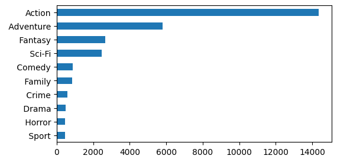
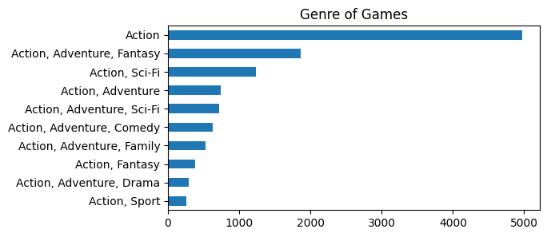
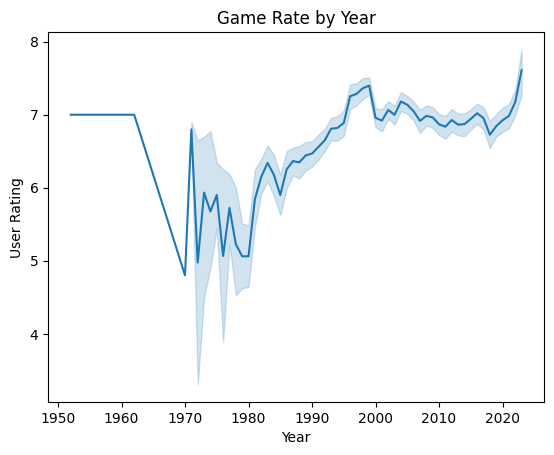

# Laporan Proyek Machine Learning - Reza Faisal

## Project Overview

Video game dapat didefinisikan sebagai sebuah permainan yang dimainkan dengan peralatan audiovisual dan dapat didasarkan pada sebuah cerita fiksi. Video game telah beradaptasi menjadi budaya, bentuk seni, narasi, alat pendidikan, dan masih banyak lagi. Terlepas dari semua itu videogame mempunyai arti adalah sebuah permainan. Jadi singkatnya videogame adalah perkembangan dari sebuah permainan yang bisa kita mainkan melalui mesin computer, konsol game, maupun ponsel.

Permainan atau game itu sendiri juga mempunyai pengertian tersendiri, game adalah aktivitas fiktif, tidak terduga, dan tidak produktif dengan aturan, dan terbatas ruang dan waktu dengan melakukannya tanpa kewajiban[1]. 

Karena banyaknnya jenis video game dan masing-masing jenis tersebut mempunyai media hiburan tersendiri, maka dari itu sistem ini dapat membantu memberikan rekomendasi video game berdasarkan genre permainan yang disukai pengguna. Hal ini akan berdampak pada meningkatkan penjualan video game melalui rekomendasi video game yang diberikan.

## Business Understanding

### Problem Statements

- Mencari jenis video game yang serupa tidak mudah, karena begitu banyaknya jenis video game yang sudah di produksi.
- Pengguna terkadang kebingungan untuk memilih game yang sudah direkomendasikan mana yang harusnya di beli dan dimainkan.

### Goals

- Membuatkan sistem rekomendasi yang dapat menentukan video game yang memiliki genre yang serupa.
- Memberikan personalisasi seperti tahun terbit, rating, dan jumlah pemain sehingga dapat menjadi pertimbangan pengguna untuk membeli sebuah permainan video game.

## Data Understanding
Dataset ini berasal dari *platform open source* yaitu **kaggle.com**, data ini memuat tentang beberapa informasi mengenai video game berdasarkan IMBDb Rating. Data ini terdiri dari 14682 baris dan 11 kolom.

Link dataset : [kaggle.com/datasets](https://www.kaggle.com/datasets/lorentzyeung/imdb-video-games-dataset)

Berikut uraian masing-masing fitur pada daaset :
| **Fitur** | **Deskripsi** | **Tipe Data** |
|---|---|---|
| Title | judul video game | polynominal |
| Genre | genre yang dimiliki video game tersebut | polynominal |
| User Rating | peringkat yang diberikan pada video game tersebut oleh pengguna IMDb | float |
| Number of Votes | Jumlah total suara dan ulasan yang diterima oleh video game | polynominal |
| Runtime | Durasi gameplay atau waktu berjalannya video game aksi | polynominal |
| Year | ahun peluncuran video game, dengan akhiran " Video Game" dihapus. | integer |
| Summary | Ringkasan atau deskripsi singkat tentang video game. | polynominal |
| Director | Sutradara yang terkait dengan pengembangan video game. | polynominal |
| Stars | Bintang atau aktor yang ditampilkan dalam video game. | polynominal |
| Certificate | Peringkat sertifikat yang diberikan pada video game (misalnya, PG-13, R). | polynominal |

<small class="content-footer">Tabel 1. Penjelasan Fitur pada Dataset</small>

### Exploratory Data Analysis
Untuk kasus ini, fitur genre akan digunakan sebagai acuan untuk mendapatkan rekomendasi antara 1 video game dengan video game lainnya yang memiliki genre yang sama atau serupa.

**Berikut Visualisasi Data Genre**

Gambar 1. Data Genre Unik pada Dataset

Pada Gambar 1 dapat dilihat bahwa sebagian besar video game memiliki genre *action*, kemudian disusul dengan genre *adventure* dan seterusnya.
 

Gambar 2. Data Kombinasi Genre Unik pada Dataset

Bahkan pada data genre kombinasi, action masih yang tertinggi. Ini menunjukkan bahwa pasar video game dengan genre action lebih disukai pengguna karena tidak gampang bosan.
 

Gambar 3. Perkembangan Rating Pengguna setiap Tahun

Dari visualisasi diatas dapat dilihat bahwa rating game mengalami penurunan antara tahun 1960 - 1970 dan mulai mengalami peningkatan yang signifikan pada awal tahun 1990.

## Data Preparation

Data preparation adalah tahap dimana data akan dibersihkan, dinormalisasi, diubah sedimikian rupa sehingga data tersebut siap untuk diolah pada proses selanjutnya yaitu membangun model (Modelling).

Berikut tahapan yang dilakukan pada kasus ini :
- Mengubah nama kolom atau fitur dari *Capitalize* menjadi *lower case* serta mengganti spasi dengan *underscore* agar memudahkan dalam seleksi berdasarkan fitur.
- Menghapus *missing value*, terdapat setidaknya 6028 lebih baris yang tidak memiliki nilai. Tahap ini dilakukan agar data menjadi lebih konsisten serta memudahkan dalam proses perhitungan statistik.
- Menghapus *duplicate*, terdapat 7 data yang akan dihapus agar data pada dataset hanya terdapat yang unik saja. Tahap ini dilakukan agar tidak terjadi bias pada etnik atau kelompok tertentu serta dapat meningkatkan efisiensi analisis karena mencegah pengolahan data yang berulang.
- Mengubah tipe data *`number_of_votes`* dari string menjadi integer agar dapat dilakukan operasi perhitungan seperti perbandingan atau bahkan pengurutan.
- Melakukan penambahan fitur sesuai dengan genre yang unik pada fitur genre agar dapat dihitung *Cosine Similarity* nya, teknik ini akan menghasilkan sebanyak 34 fitur baru berdasarkan banyaknya genre unik pada data.
- Pada tahapa akhir, dataset hanya akan berisi fitur title serta fitur-fitur genre yang jika ditotal memiliki 35 kolom.

## Modelling
Tahapan ini membahas mengenai model sisten rekomendasi yang dibuat untuk menyelesaikan permasalahan. Sajikan top-N recommendation sebagai output.

Pada kasus ini akan digunakan pendekatan *Content-Based Filtering* , yaitu menampilkan produk yang memiliki kemiripan dari beberapa aspek yang sesuai dengan produk yang dipilih, pada dataset ini yang dijadikan acuannya adalah fitur `genre`.

Berikut adalah tahap-tahap yang dilakukan pada proses ini :
#### Menerapkan proses *cosine similarity*
*Cosine Similarity* adalah metrik yang digunakan untuk menentukan seberapa mirip dokumen terlepas dari ukurannya. Dalam penerapannya, *cosine similarity* akan mengukur kesamaan antara dua vektor dan menentukan apakah kedua vektor tersebut menunjuk ke arah yang sama. *Cosine similarity* akan menghitung sudut cosinus antara dua vektor dimana semakin kecil sudut cosinus, semakin besar nilai *cosine similarity*. Berikut merupakan ilustrasinya:

Gambar 5. Cosine Similarity
 

*Cosine Similarity* dapat dirumuskan sebagai berikut : 

Gambar 6. Rumus *Cosine Similarity*
 

Proses *cosine similarity* dapat kita terapkan pada bahasa Python menggunakan bantuan *library* Sckit-Learn yaitu `cosine_similarity()` yang menerima inputan berupa vector matriks genre yang sudah kita proses sebelumnya.

#### Mendapatkan Rekomendasi
Setelah dihitung *Cosine Similarity*-nya, selanjutnya membuat rekomendasi berdasarkan judul film yang dipilih. Berikut ini adalah tahap-tahap yang dilakukan :
- Membuat fungsi `display_recommendation()` yang berfungsi untuk menampilkan dilayar console dengan format yang telah disesuaikan.
- Membuat fungsi `game_recommendations()` untuk menentukan video game apa yang serupa berdasarkan matriks genre hasil perhitungan cosine similarity yang tertinggi dengan judul video game yang dicari.
- Mendapatkan rekomendasi video game dengan judul `Chiller` yang memiliki genre `Action, Horror` berdasarkan `number_of_votes`

 **Title** | **Cosine Sim** | **Genre** 
---|---|---
 Left 4 Dead 2 | 1 | Action, Horror 
 Left 4 Dead | 1 | Action, Horror 
 The Walking Dead: Survival Instinct | 1 | Action, Horror 
 Aliens vs. Predator 2 | 0.816 | Action, Horror, Sci-Fi 
 Resident Evil: Operation Raccoon City | 0.816 | Action, Horror, Sci-Fi 

Tabel 2. Hasil Rekomendasi
 

Dapat dilihat hasil yang direkomendasikan memiliki kemiripan dengan genre video game yang dicari yaitu `Action, Horror`, meskipun terdapat 2 game yang tidak sama persis yaitu `Aliens vs. Predator 2` dan `Resident Evil: Operation Raccoon City` yang memiliki nilai *cosine similarity* sebesar `0.816`

#### Kelebihan dan Kekurangan

**1. Kelebihan**

- *Cold Start* Problem: Metode ini lebih efektif dalam menangani masalah "*cold start*," yaitu ketika sistem harus memberikan rekomendasi untuk item baru yang belum memiliki data historis pengguna. Ini dapat dilakukan dengan menganalisis karakteristik konten item.

- Transparansi: *Content-based* filtering relatif mudah dipahami oleh pengguna karena algoritma didasarkan pada atribut-atribut item yang dapat dijelaskan dengan mudah (misalnya, genre film, penulis buku, atau kata kunci).

- Over-specialization: *Content-based* filtering cenderung menghasilkan rekomendasi yang sangat sesuai dengan preferensi pengguna karena didasarkan pada fitur-fitur spesifik dari item. Ini dapat membantu pengguna menemukan item yang sangat relevan.

**2. Kekurangan**
- Keterbatasan Dalam Diversitas Rekomendasi: Salah satu kekurangan utama *content-based* filtering adalah cenderung menghasilkan rekomendasi yang kurang beragam karena fokus pada atribut-atribut item yang mirip dengan yang disukai pengguna sebelumnya. Ini bisa membuat pengguna kehilangan kesempatan untuk menemukan item yang berbeda atau baru.

- Keterbatasan Dalam Menangani Bubble Filter: *Content-based* filtering dapat memperkuat apa yang disebut sebagai "bubble filter," yaitu pengguna hanya menerima rekomendasi yang sejalan dengan pandangan mereka sendiri. Ini dapat mengurangi kemampuan pengguna untuk mengeksplorasi opini atau pandangan yang berbeda

## Evaluation
Pada pendekatan ***Content-Based Filtering***, evaluasi dilakukan secara manual menggunakan *metric Precision* (Presisi) yang dikhususkan untuk model sistem rekomendasi. Dalam sistem rekomendasi, *precision* merupakan jumlah item rekomendasi yang relevan dimana penggunaannya dapat dilakukan secara manual. Dalam hal ini, *precision* tidak dapat dihitung dengan memanggil library scikit learn karena tidak ada data target/label, seperti pada supervised learning. Pada sistem rekomendasi, *precision* dapat dirumuskan sebagai berikut:

Gambar 5. Rumus Precision
 

Pada kasus ini, pengguna membeli game `"Chiller"` genre action, horror dan akan diberikan rekomendasi video game yang sesuai dengan genrenya. Berikut adalah hasil rekomendasinya :

| **Title** | **Genre** |
|---|---|
| Left 4 Dead 2 | Action, Horror |
| Terrordrome: Rise of the Boogeymen | Action, Horror |
| Fright Night | Action, Horror |
| Call of Duty: Black Ops - Zombies | Action, Horror |
| Koudelka | Action, Horror |

Tabel 3. Hasil Rekomendasi
 

Dari hasil rekomendasi Tabel 2 dapat dilihat bahwa game `Chiller` memiliki genre `action` dan `horror`. Dari 5 item yang direkomendasikan memiliki kemiripan atau *similarity* yang tinggi bahkan sama. Jadi, jika mengacu pada formula *precision* sebelumnya, skor *precision* sistem rekomendasi yang dibuat, yakni sebesar 5/5 atau 100%.

## Kesimpulan

Hasil dari sistem yang dibuat, dapat disimpulkan bahwa hasil rekomendasi yang diberikan oleh sistem sudah sesuai dengan personalisasi berdasarkan rating, jumlah vote, dan tahun rilis sehingga membuat pengguna akan lebih mepertimbangkan game yang akan dibeli/dimainkan berdasarkan hasil rekomendasi tersebut. Dataset ini sudah sangat bagus untuk menggunakan pendekatan *content-based filtering* karena memiliki data cukup lengkap yang dapat dilihat dari tahun rilisnya.

## Referensi
[1] Caillois, Roger. (2021). Apa itu video game. Online at https://www.dictio.id/t/apa-itu-video-game/160579, accessed 28 September 2023